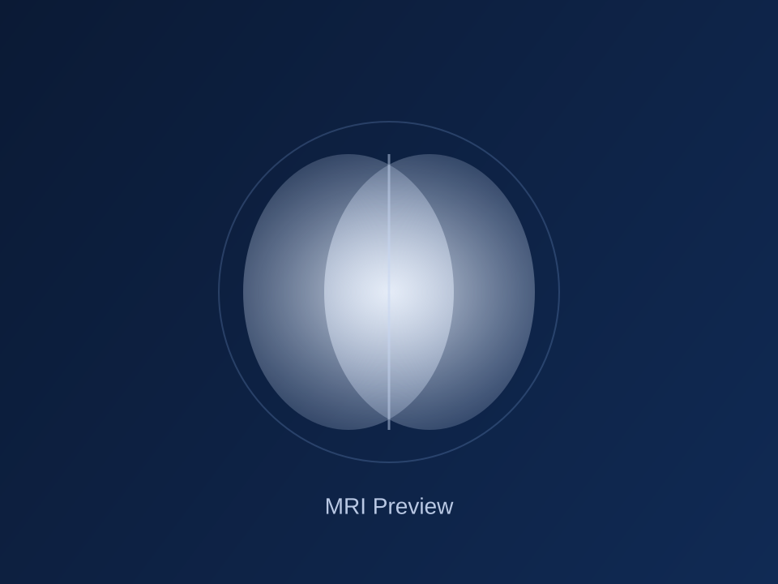
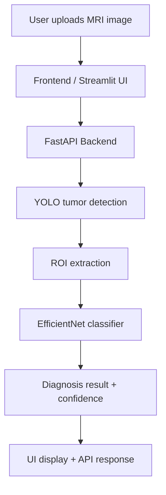
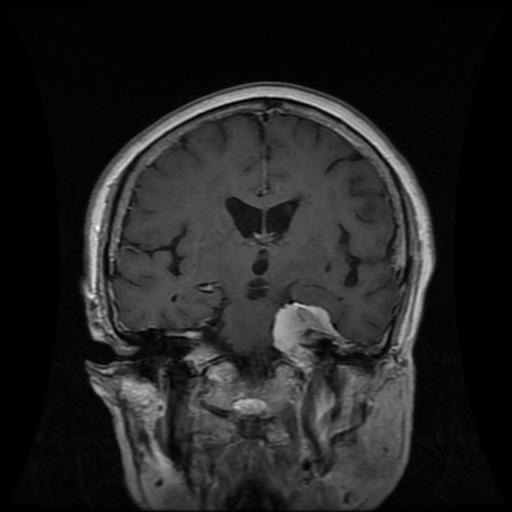
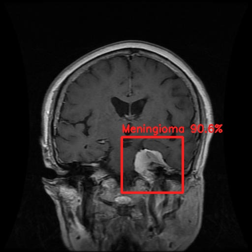
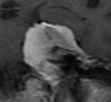

# Brain Tumor Diagnosis

<p align="center">
  
</p>

A complete AI-powered medical imaging project for brain tumor detection and classification from MRI scans. The system combines object detection and deep learning classification to identify tumor regions and predict lesion type with a web-based interface for doctors and patients.

## Overview

This project is designed to help detect and classify brain tumors from MRI images using a hybrid AI pipeline:

- YOLO-based tumor detection for localizing suspicious regions
- EfficientNet model for final tumor-type classification
- FastAPI backend for medical workflow APIs
- Streamlit / frontend UI for image upload and visual analysis
- Patient/doctor workflow support with authentication and local database fallback

The goal is to provide a practical and demonstrative brain tumor diagnosis prototype with explainable outputs and a user-friendly interface.

## Key Features

- MRI image upload and preprocessing
- Tumor localization with bounding boxes
- Multi-class diagnosis: Glioma, Meningioma, No Tumor, Pituitary
- Confidence-based result presentation
- Explainable outputs via Grad-CAM-style overlay approach
- API support for auth, patient management, and diagnosis workflows
- Cross-platform Python implementation with local model support

## System Architecture



## Tech Stack

- Python 3.10+
- PyTorch
- Ultralytics YOLO
- OpenCV
- FastAPI
- Streamlit
- Supabase-ready database layer
- JWT authentication
- Pillow / NumPy

## Project Structure

```text
BrainTumor_Project/
├── app/
│   ├── app.py                     # FastAPI application entry point
│   ├── backend/
│   │   ├── ai_service.py          # Core AI inference pipeline
│   │   ├── auth.py                # Authentication logic
│   │   ├── database.py            # DB and local fallback logic
│   │   ├── main.py                # Backend API routes
│   │   ├── models.py              # Data models
│   │   ├── schemas.py             # Pydantic schemas
│   │   ├── supabase_setup.py      # Supabase configuration helper
│   │   └── test_api.py            # API smoke tests
│   └── frontend/
│       ├── js/
│       ├── styles/
│       ├── *.html                 # User-facing web pages
│       └── assets/
├── data/                          # MRI samples and annotated images
├── models/                        # Local ML model files
├── .dockerignore
├── .gitignore
├── Dockerfile
├── LICENSE
├── README.md
├── requirements.txt
├── Start_BrainAI.command
└── venv/                          # Local Python environment (ignored in Git)
```

## Model Information

This project uses a hybrid two-stage deep learning pipeline:

1. YOLO detection model for tumor localization
2. EfficientNet-B0 classifier for tumor type recognition

Supported prediction classes:

- Glioma
- Meningioma
- No Tumor
- Pituitary

> Important: large model files and local virtual environments are intentionally excluded from Git tracking for repository size management. Place your trained model weights in the `models/` directory before running inferences.

## Installation

### 1. Clone the repository

```bash
git clone https://github.com/Andrew-Vo-G/Brain-Tumor-Diagnosis.git
cd Brain-Tumor-Diagnosis
```

### 2. Create a virtual environment

```bash
python -m venv venv
```

On Windows:

```bash
venv\Scripts\activate
```

On macOS / Linux:

```bash
source venv/bin/activate
```

### 3. Install dependencies

```bash
pip install -r requirements.txt
```

### 4. Prepare model files

Ensure these files exist in the `models/` directory:

```text
models/
├── yolo_best.pt
├── efficientnet_final.pth
```

## Running the Project

### A. Start the backend API

```bash
cd app
uvicorn app:app --host 0.0.0.0 --port 8000 --reload
```

### B. Start the frontend UI

```bash
streamlit run app.py
```

The app will open in the browser and allow you to upload MRI scans for analysis.

### C. Optional: Docker run

```bash
docker build -t brain-tumor-diagnosis .
docker run -p 8000:8000 brain-tumor-diagnosis
```

## Data and Sample Images

The project includes a curated dataset folder with MRI samples and annotated variations, suitable for testing, visualization, and model validation.

### Sample MRI collection

<p align="center">
  <table>
    <tr>
      <td align="center">
        
        <br><b>Figure 1.</b> Original MRI scan
      </td>
      <td align="center">
        
        <br><b>Figure 2.</b> Annotated MRI result
      </td>
      <td align="center">
        
        <br><b>Figure 3.</b> Zoomed tumor region
      </td>
    </tr>
  </table>
</p>

### Tumor-focused sample examples

<p align="center">
  <table>
    <tr>
      <td align="center">
        
        <br><b>Figure 4.</b> Raw MRI input sample
      </td>
      <td align="center">
        
        <br><b>Figure 5.</b> Annotated tumor region
      </td>
      <td align="center">
        
        <br><b>Figure 6.</b> Focused region of interest
      </td>
    </tr>
  </table>
</p>

### Example inference output

<p align="center">
  
  <br><b>Figure 7.</b> AI inference visualization with detected lesion and predicted class.
</p>

## Model Workflow

The inference flow follows this sequence:

1. MRI image is uploaded by the user.
2. The image is processed and resized for analysis.
3. YOLO identifies suspicious tumor-containing regions.
4. ROIs are cropped around detected objects.
5. EfficientNet classifies the patch into one of the tumor classes.
6. Result is returned with confidence score and optional visual overlay.

## Example Use Cases

- Clinical prototype for early tumor screening
- Medical education and visualization
- Research experimentation with MRI datasets
- Internally demonstrative AI diagnostic support tool

## Training and Dataset Notes

The project is built around MRI-based brain tumor classification and uses a mix of scan samples and annotated visual outputs stored in the `data/` directory. The design supports experimentation with additional datasets and retraining using improved architectures.

## Limitations

- This is a prototype and not a certified medical diagnostic system.
- Model performance depends heavily on dataset quality and image acquisition consistency.
- Large model files are not included in GitHub by default due to file-size restrictions.
- Real clinical deployment should include medical validation, privacy controls, and regulatory review.

## Security and Privacy

- Local environment variables and patient metadata should be managed carefully.
- Sensitive medical data should not be uploaded to public repositories without proper consent and compliance review.
- Production deployment should use secure storage and access controls for patient data.

## License

This project is licensed under the MIT license. See the [LICENSE](LICENSE) file for details.

## Contributing

Contributions are welcome. You can:

- improve model accuracy
- optimize the inference pipeline
- add medical UI enhancements
- extend the backend API and doctor workflows

## Contact

For collaboration or technical questions, open an issue or reach out through the repository maintainers.

---

<p align="center">
  <strong>Brain Tumor Diagnosis</strong>
  <br>
  AI-assisted MRI analysis for tumor detection and classification.
</p>
