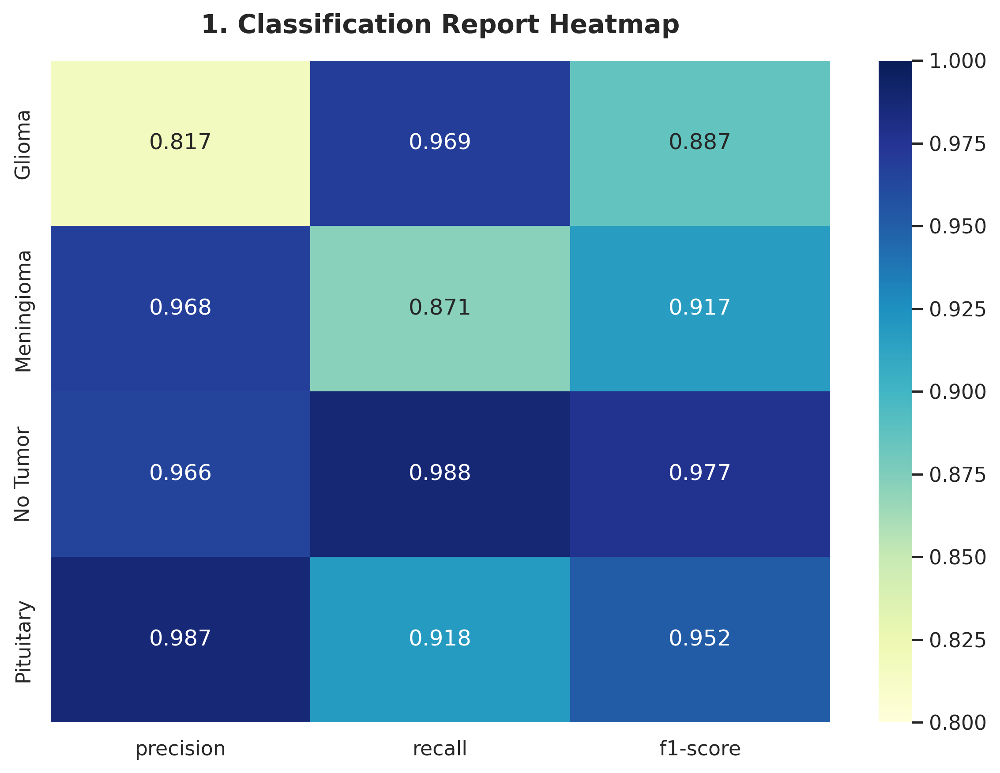
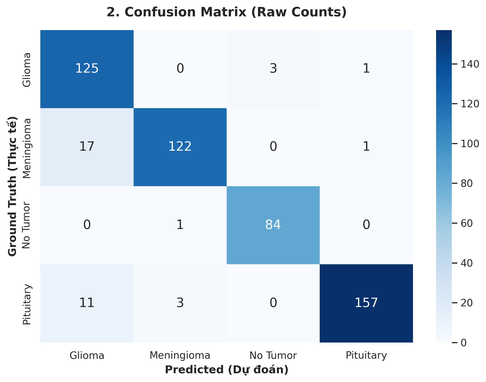
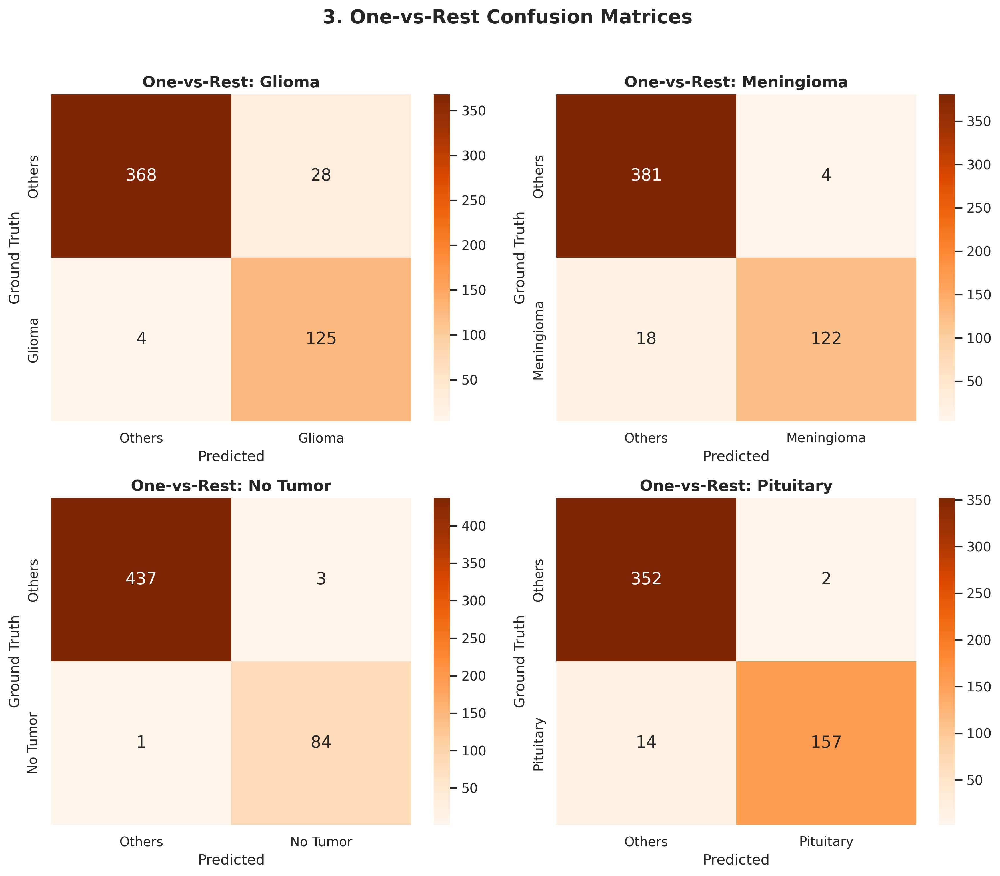
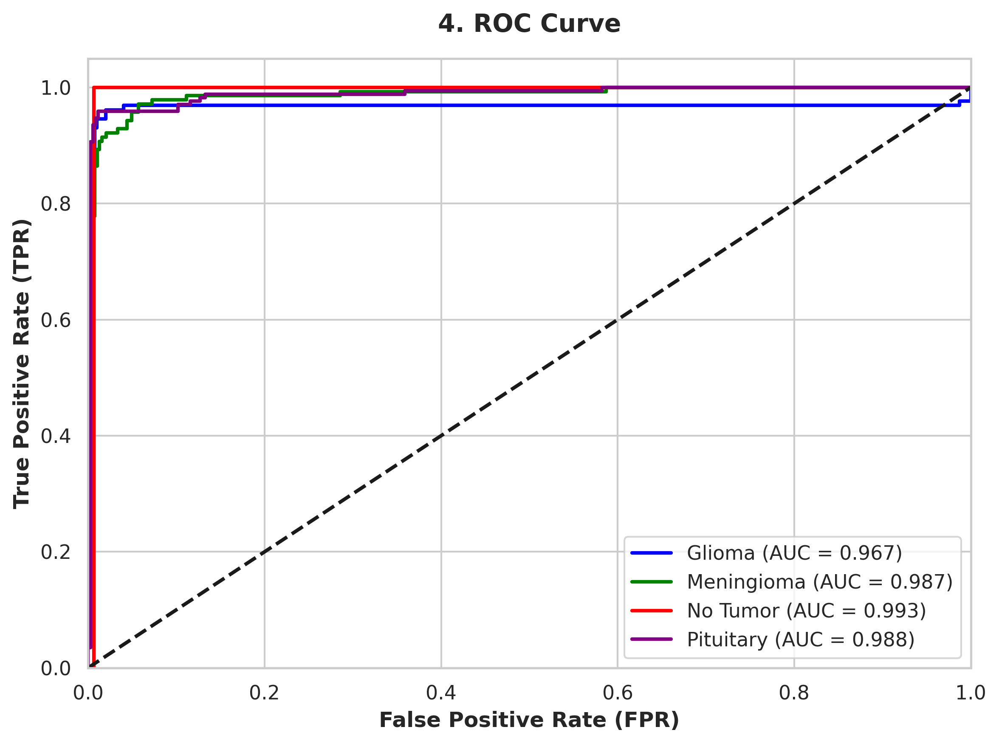

# Brain Tumor Detection and Classification using MRI

<p align="center">
  
</p>

## Overview

This project develops an AI-assisted system for brain tumor detection and classification from magnetic resonance imaging (MRI) scans. The proposed system combines object detection and deep learning classification to localize suspicious regions and determine the most likely tumor type.

The solution is designed as a practical and extensible prototype for image-based medical diagnosis support, with a web interface for uploading MRI images and reviewing model predictions.

## Abstract

Brain tumors are among the most serious neurological conditions and require early and accurate diagnosis to support clinical decision-making. In modern medical practice, magnetic resonance imaging (MRI) is a standard method for examining brain abnormalities; however, manual interpretation of MRI scans is time-consuming and can be influenced by observer variation. This project proposes an intelligent diagnostic system that combines object detection and deep learning-based classification to support the analysis of MRI images.

The system utilizes YOLO for tumor localization and EfficientNet-B0 for classifying the MRI region into one of several tumor categories. A user-friendly interface allows medical professionals or researchers to upload MRI scans, observe the detected lesion area, and review the predicted class and confidence score. The project demonstrates a practical pipeline for automation in medical image analysis and provides a foundation for future research and clinical-oriented extension.

## Problem Statement

Brain tumor diagnosis requires careful interpretation of medical images and often depends on the expertise of radiologists. Manual analysis can be time-consuming and may be affected by inter-reader variability. Early and accurate detection is important for clinical decision-making and treatment planning.

This project addresses that problem by building an automated pipeline that can process MRI scans and provide both localization and classification results.

## Research Motivation

Medical image analysis is a crucial field of computer vision with direct impact on patient care. Although deep learning has shown strong performance in image recognition tasks, diagnostic systems must remain understandable, interpretable, and practical for real-world use. This project is motivated by the need to bridge the gap between research-oriented deep learning methods and a usable application for medical image review.

## Objectives

- Build an image-processing pipeline for MRI-based brain tumor analysis.
- Detect abnormal regions using object detection techniques.
- Classify the affected area into tumor categories.
- Provide a user-friendly interface for image upload and result visualization.
- Design the system in a way that is suitable for further research and extension.

## Scope of the Project

The system focuses on the following scope:

- MRI-based image processing
- Tumor localization using an object detection model
- Classification of brain tumor categories
- Local prototype deployment for testing and demonstration
- User interface for image upload and result presentation

The project does not replace a medical professional or formal clinical diagnosis system. Instead, it serves as an assistive system for research, demonstration, and early-stage analysis.

## Methodology

The system uses a hybrid approach that combines two complementary tasks:

1. Tumor localization using YOLO
2. Tumor classification using EfficientNet-B0

This two-stage strategy allows the model to first identify suspicious regions and then classify the relevant areas based on their visual characteristics.

### Data Preparation

The project uses MRI image samples stored in the data folder, including raw images and annotated variants. The dataset contains representative examples of brain scans with and without tumor presence. Image preprocessing is performed to standardize the input for the deep learning pipeline.

### Preprocessing

The preprocessing stage includes:

- conversion to RGB format when needed
- resizing and normalization
- region-of-interest extraction around detected tumor areas
- preparation for model inference

### Detection Stage

YOLO is used to detect suspicious regions and generate bounding boxes around candidate tumor areas. This stage helps narrow the area of interest and reduces the search space for the classifier.

### Classification Stage

EfficientNet-B0 is used as the classification backbone for identifying the tumor category from cropped or full MRI regions. The model is trained on labeled image samples and outputs the predicted class along with confidence levels.

### Pipeline

```text
MRI input
  -> preprocessing
  -> YOLO-based tumor detection
  -> ROI extraction
  -> EfficientNet classification
  -> predicted class + confidence score
  -> result visualization
```

## Dataset and Classes

The project uses MRI image samples stored in the data folder, with representative examples of normal and pathological brain scans. The classifier is designed for the following categories:

- Glioma
- Meningioma
- No Tumor
- Pituitary

## Model Design

### YOLO for Detection

YOLO is used to detect suspicious regions and generate bounding boxes around candidate tumor areas. This stage helps narrow the region of interest and reduce the search space for classification.

### EfficientNet for Classification

EfficientNet-B0 is used as the classification backbone for identifying the tumor category from cropped or full MRI regions. The model is trained on labeled MRI samples and outputs the class with associated confidence.

## System Architecture

```text
User interface
    |
    v
FastAPI / backend services
    |
    v
AI inference engine
    |-- YOLO detection
    |-- ROI extraction
    |-- EfficientNet classifier
    |
    v
Result + visualization + response
```

## Project Structure

```text
BrainTumor_Project/
├── app/
│   ├── app.py
│   ├── backend/
│   │   ├── ai_service.py
│   │   ├── auth.py
│   │   ├── database.py
│   │   ├── main.py
│   │   ├── models.py
│   │   ├── schemas.py
│   │   ├── supabase_setup.py
│   │   └── test_api.py
│   └── frontend/
│       ├── assets/
│       ├── js/
│       ├── styles/
│       └── *.html
├── data/
│   ├── MRI samples
│   └── annotated examples
├── docs/
│   └── notebook visualization exports
├── models/
│   ├── yolo_best.pt
│   └── efficientnet_final.pth
├── Dockerfile
├── LICENSE
├── README.md
├── requirements.txt
├── Start_BrainAI.command
├── .gitignore
└── venv/
```

## Technologies Used

- Python
- PyTorch
- TorchVision
- Ultralytics YOLO
- OpenCV
- Pillow
- NumPy
- FastAPI
- Streamlit
- JWT / authentication support

## Installation and Setup

### 1. Clone the repository

```bash
git clone https://github.com/Andrew-Vo-G/Brain-Tumor-Diagnosis.git
cd Brain-Tumor-Diagnosis
```

### 2. Create a virtual environment

```bash
python -m venv venv
```

Windows:

```bash
venv\Scripts\activate
```

Linux / macOS:

```bash
source venv/bin/activate
```

### 3. Install dependencies

```bash
pip install -r requirements.txt
```

### 4. Prepare model files

Make sure the model weights are available in the models directory:

```text
models/
├── yolo_best.pt
├── efficientnet_final.pth
```

> Large model files are intentionally excluded from GitHub tracking due to repository size limits.

## Running the Application

### Start the backend

```bash
cd app
uvicorn app:app --host 0.0.0.0 --port 8000 --reload
```

### Start the frontend UI

```bash
streamlit run app.py
```

## Sample Results

### Model visualization and detection examples

<p align="center">
  <table>
    <tr>
      <td align="center">
        
      </td>
      <td align="center">
        
      </td>
      <td align="center">
        
      </td>
    </tr>
    <tr>
      <td align="center">
        
      </td>
      <td align="center">
        
      </td>
      <td align="center">
        
      </td>
    </tr>
  </table>
</p>

### MRI annotation examples

<p align="center">
  <table>
    <tr>
      <td align="center">
        
        <br>Annotated MRI input
      </td>
      <td align="center">
        
        <br>Zoomed ROI
      </td>
      <td align="center">
        
        <br>Detected tumor area
      </td>
    </tr>
  </table>
</p>

## Evaluation Approach

Model evaluation in a medical imaging project should consider both detection and classification quality. The proposed workflow is evaluated from the perspective of:

- tumor localization performance
- robustness of the detection step across MRI samples
- classification accuracy across image categories
- stability of inference for practical use cases

Although numerical results are not included in this repository summary, the project is structured so that these evaluation criteria can be measured systematically on a test dataset in a formal experimental setup.

## Results and Discussion

The implemented pipeline demonstrates that a combined detection-classification approach can be used for tumor recognition in MRI images. The detection stage helps localize regions of interest, while the classification stage provides the final diagnostic label and confidence level.

The use of a two-step approach is beneficial because it separates object localization from category prediction. This design improves interpretability and makes the output easier to inspect visually, which is important in medical image analysis workflows.

## Limitations

- The system depends on data quality and scan consistency.
- Prediction accuracy may vary depending on imaging conditions and preprocessing.
- Model weights are not included in the public repository because of GitHub size restrictions.
- Additional clinical validation is required before deployment in healthcare settings.
- This is a prototype and should not be considered a medical device or certified diagnostic tool.

## Future Development

- Expand the dataset with more diverse medical samples.
- Improve model accuracy through transfer learning and optimization.
- Add explainability features for medical review.
- Extend the application to support broader diagnostic workflows and reporting.
- Integrate more advanced validation metrics and clinical-oriented evaluation pipelines.

## Conclusion

This project presents a practical and educational approach to brain tumor detection and classification using MRI images. By combining YOLO-based localization and EfficientNet-based classification, the system demonstrates how deep learning can be applied to a meaningful medical imaging task. The resulting application supports image upload, automatic analysis, and visual interpretation of tumor-related findings.

The project provides a solid foundation for further research and can be extended with larger datasets, stronger model optimization, and deeper clinical validation in future work.

## License

This project is distributed under the MIT License. See [LICENSE](LICENSE) for details.

---

<p align="center">
  <strong>Brain Tumor Detection and Classification System</strong>
  <br>
  AI-assisted MRI analysis for tumor localization and classification.
</p>
